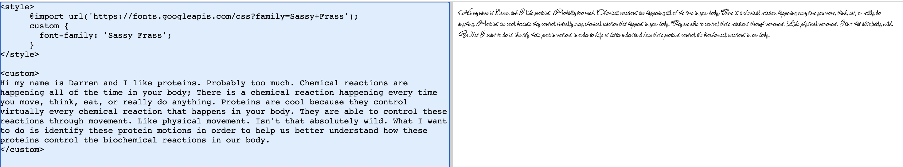
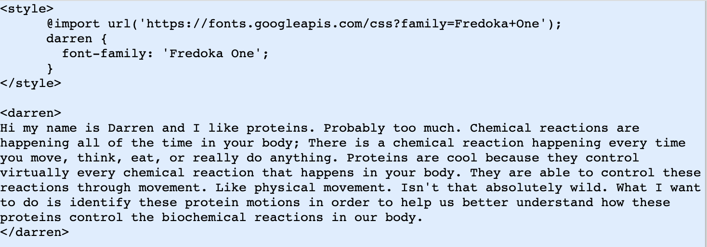

# Dressed in Affirmations tutorial 

Hi, sorry I couldn't be here. I'm currently waiting to get onto a flight to San Diego.

How are you? Hmm I don't think I heard you. Could you say that again? (Please repeat what you just said) (*3 seconds of awkward silence*) Nice. How was your week (list three things)? My week was great thanks for asking, although it could've been better. I like your outfit today, the colors match really well.

I'm a STEM major so my spelling is atrocious so forgive me if I mispll certin thngs. I also don't expect you to finish this at all, so take your time and go at your own pace. If you have any questions you need to ask me, send them to me at [liudarren3@gmail.com]. I won't be able to respond quickly but I'll try my best to respond when I can .

**One quick disclaimer:** Square is great and all for website design and it integrates online shopping really well. However, it doesn't really give you full control over everything that you would like to. There might be somethings that are either impossible or really hard to change and it's definitely not going to be your fault; Websites like these can be really annoying to navigate so keep that in mind. 

## Getting to the website
1st, let's get to the website
1. [Login](https://squareup.com/login?lang_code=en-us) into the square website
2. Input your information. I don't think you enabled two-factor authentication, but if you need a code that was sent to me or whatnot let the other teachers know and they can ping me
3. On the left-hand toolbar, click the 'Online' button and it will take you to 'Online' page. It make take some time so you might have to wait a bit


4. On the left-hand toolbar, click the 'Website' button and then 'Edit site' to get to your page 
    - **Ignore this if your website looks familiar.** If the website **does not look familiar** it is likely because you are on a different template. go back onto the Online page and click the 'Site' bar. You should be then able to choose from a series of different templates. Choose a different template and hit the 'Edit Site' button to get to the page you want.
5. You are now at the website editor! The elements of your website are shown on the left and the page itself is shown on the right. If you mouse over the left elements, the corresponding website elements will be highlighted in blue on the right. **The order that the elements appear in can be changed by clicking and dragging the element up and down the toolbar**
## Your bio (AKA adding text and images together)

Let's start to get used to square. Let's make your biography first. Looking on your Canva website, the biography looks to be an image (on the left) next to some text on the right.

1. On the top left of the page, there should be a '+' sign next to a gear sign. Click on the plus and click 'Section' to add a new section. There should be a toolbar on the left


3. Scroll down until you hit the **Text and image** button and click it
4. This will give a little window that will give you different options for how you want to format the text and image. Click the one that you like the best. (your original website had the photo on the left and the text on the right)
5. Click the blue 'Add' button in the top left
6. From here we can actually start to edit the text. Click on the text and start typing to be able to edit the text. You will have some options to edit the style of the text on the left bar. You should play around with these. I do not think you will be able to change how the text wraps around or the general color of the text. 
7. If you don't want a Title, you can click the 'Title' button on the left and click the blue switch button.


8. To add an image, click the empty box with the mountain on it. On the left, click the 'Add image' button. 
9. Click the 'Add files here or click to upload button' and upload the picture you would like. The image should now appear in the window
10. Click the image on the window and click the blue 'Done' button in the top right. The image should now appear!

Okay you have an idea of how to manipulate images and text. Similar things can be done if you choose the 'images' or 'Text' buttons when you add sections. While the pre-built elements are quite nice, you might want to make some custom fonts

# Typing with not the standard font
## This might be a bit difficult, so don't worry if this takes a while
So you want to have several different types of text in our website, with things like 'Be Brave', 'Hello Darling', and 'Glow'. All of these phrases are in different fonts! However...

Square has some pretty big limitations on the types of fonts it will allow you to use (by which, you can only use one). The default font is very professional, but honestly kinda of boring in my opinion so here I'll teach you how to integrate your own fonts. Hopefully this is where the html tutorials will come in handy...

1st, we need to insert a code block into our website.
1. Like in the previous section: On the top left of the page, there should be a '+' sign next to a gear sign. Click on the plus and click 'Section' to add a new section. There should be a toolbar on the left
2. Scroll down and click the 'Embded code' block.
3. Make sure that the format of the Embeded code block is the format where there is text above the code block. 
4. Remove the 'Section title' and 'Section description' by hitting the blue switch button. You should have a blank box with just a '< >' in the website preview
5. When you click on that box, a box should pop up on the left saying 'Paste embeded code here'


**Here is where the fun starts.** We will be pasting our own html code into the 'code input' and it should be shown in the 'code output' window. However, let's take a (not so quick) detour into styling.

# Introduction to custom font styling (and re-introduction into html)

**You'll be coding in this section. If you end up stopping in the middle of this section, I would recommend copy pasting your current code into an email and emailing it to yourself so that you can keep your progress**

If you look at the 'code input' box in Square, the box is really really small. It would be really annoying to try and code in such a small box so let's **code in a different website and then we can transfer the code into your website later**

1. Go to [this website](https://realtimehtml.com/)

Just like [Code.org](), you can type in the left and get text out of the right. It even updates in real time. Paste the following code into the left box.

```html
<p>
Hi my name is Darren and I like proteins. Probably too much. Chemical reactions are happening all of the time in your body; 
There is a chemical reaction happening every time you move, think, eat, or really do anything. Proteins are cool because they 
control virtually every chemical reaction that happens in your body. They are able to control these reactions through 
movement. Like physical movement. Isn't that absolutely wild. What I want to do is identify these protein motions in order to 
help us better understand how these proteins control the biochemical reactions in our body.
</p>
```

The text should look fairly normal. Here the `<p> ... </p>` tells the computer that you want the text to between the `<p> ... </p>` to be in the **paragraph** format. If you want to be in the **header** format, replace the `<p> ... </p>` with `<h1> ... </h1> `. It should look something like this:


**Notice how the style changes**. What do you see? 

HTML comes with a couple of different formats by itself like `<h2>, <mark>, <i>` and what not. But they aren't that interesting at the moment.

But what if we wanted to make our :star: **own custom formats** :star:

# Finding a custom format example

So you could try to make your own font, but the good people of google has already done this for us. Click on [this link](https://fonts.google.com/?preview.size=21) to be taken to a page where you see an insane list of fonts. I'll walk you through how to use any font you want

I really like [this font AKA Sassy Frass](https://fonts.google.com/specimen/Sassy+Frass?noto.lang=cs_Latn&query=sassy&preview.text=sassy%20frassy&preview.text_type=custom). Today feels like a very Sassy Frass kinda mood today. There is no prebuilt format for Sassy Frass format so we'll have to do a few new things. In the same way that `<p>` is a format, I'll want to make my own Sassy Frass format. In my html file, I'll write the following:

```html
<style>
      @import url('https://fonts.googleapis.com/css?family=Sassy+Frass');
      custom {
        font-family: 'Sassy Frass';
      }
</style>
```

Let me walk you through this line by line:

The `<style>...</style>` line tells the computer that we can to define a new style using everything between `<style>...</style>`. This is seperate from the text. Notice how nothing is written when you put this into the html file

The `@import` line tells the computer to load the font from a certain url (https://fonts.googleapis.com/css?family=Sassy+Frass). Because I want the font called 'Sassy Frass', the end of the url says `...css?family=Sassy+Frass` (which is Sassy Frass but with a `+` instead of a space. 

The `custom{ ... }` line tells the computer that we want to officially create our own custom format called `custom`. **You can name this whatever you want**. For instance, if I wanted to call this new format `SassyF` I would replace `custom` with `SassyF`.

Within custom, there are several different **variables** you can define. Remember them? Ask a facilitator to review it with you if you don't remember. The `:` is the same thing as an equal sign; The thing left to the `:` is the variable name and the thing to the right of the `:` is the value of the variable. The variables in custom will help us **define how we want our custom format to look like** 

Setting the `font-family` variable will specify what sort of font you want. It should be equal to the name of the font we imported. We want this to be Sassy Frass! We now have a new custom format called `custom` that will use the Sassy Frass font 

Now, if you **copy paste the code** above into your html file, what happens?
<details><summary>CLICK ME FOR THE ANSWER</summary>
Nothing!
</details>

Remember, while we have defined a new style `custom`, we still need to tell the computer to use it. Our text currently has the `<h1>` format, but we want it to use the custom format! To do this, replace `<h1> ... </h1>` with `<custom> ... </custom>`. Try this yourself! And see if you can get the text to change.

<details><summary>CLICK ME FOR THE ANSWER</summary>

</details>

# How to make your own custom format

Okay cool hopefully you understand the example now and let me try to walk you through implementing your own font.

1. Find a font you like! **Make sure that you write down the names of the fonts you like**
       - [I like this website](https://www.1001fonts.com/google-web+fun-fonts.html?page=1)
       - If you look at the top of the website, you can use different filters to find different types of fonts. **MAKE SURE THAT THE 'GOOGLE WEB' FILTER IS ALWAYS ON**
 
       - [Here is the goole fonts link](https://fonts.google.com/?preview.size=21). This lists all of the custom google fonts, but it can be hard to parse through
2. Once you find a font you like, go back to the html code. Change the end of the url (after the `family=` line) making sure to keep the same capitalization and replacing spaces with `+`. 
3. Change `font-family` to be the name of the font you want. You do not have to replace spaces with `+` here
4. Make sure that the text is using the `<custom>...</custom>` format. 
5. You should see a change! If not, let someone know. 


To make sure that you understand everything, try to change the font to `Fredoka One`. [Link here](https://fonts.google.com/specimen/Fredoka+One?preview.size=21). If you want a challenge, also change the name of the format from `custom` to `darren`.  It should look like


<details><summary>CLICK ME FOR THE ANSWER</summary>

</details>

Once you can do this, find a font that you like! And use the website to test to make sure that it can work.

# Bringing it all back together

Let's finally put this on the Square website. 
1. Go back to your code block that you put on the website
2. Paste your code into the code input box
3. See your results!

Okay I think this is enough for now. Next time we can try and customize our fonts even further! I'll teach you how to change color, size, and **many** other things about the fonts.

Let me know what worked for you! And what didn't work.
